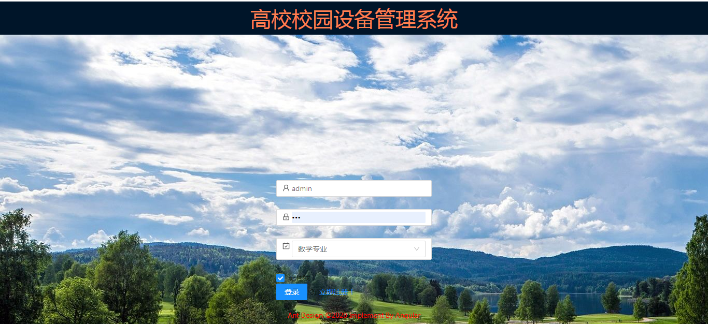
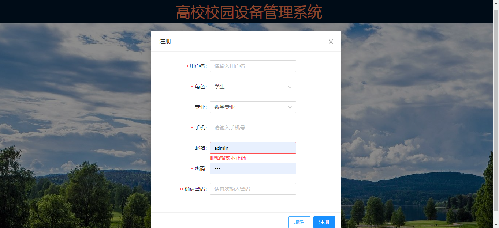
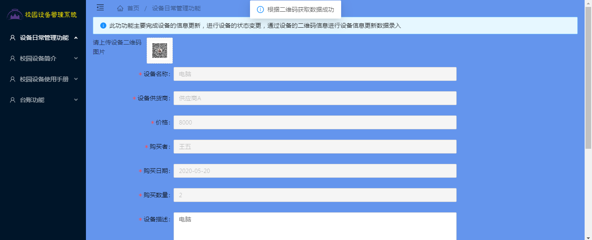
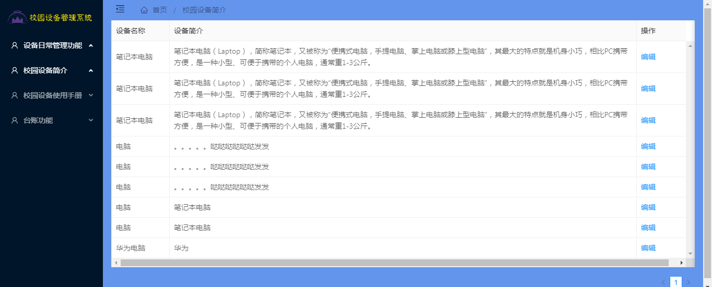
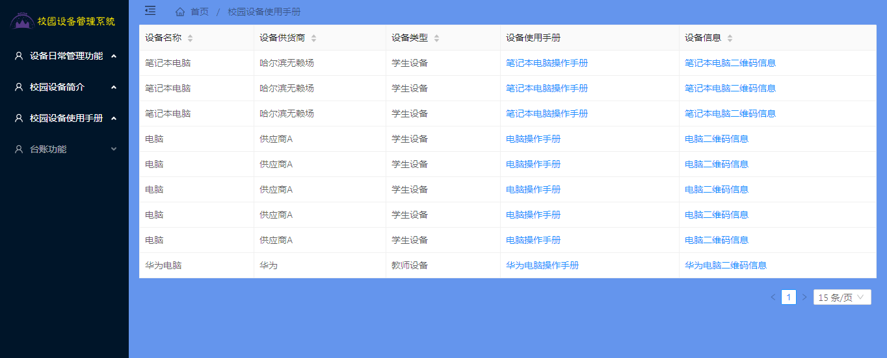
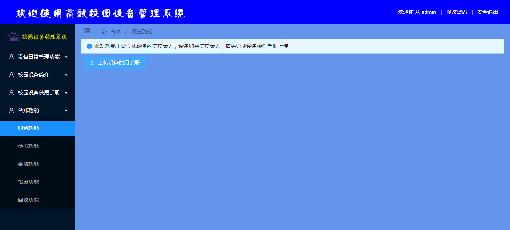
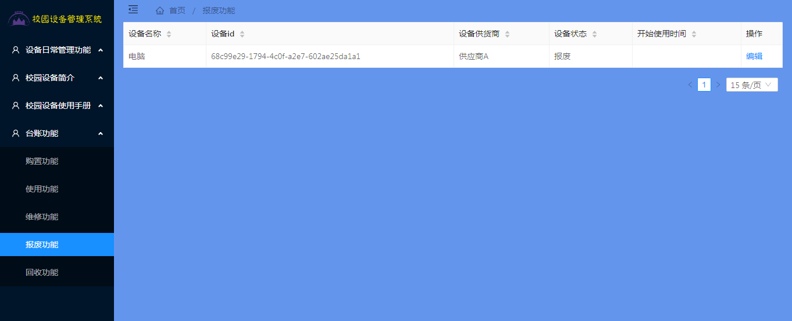

<h1 align="center">高校校园设备管理系统1</h1>

## 简介
高校校园设备管理系统：角色分为管理员、用户；提供设备日常管理、报废管理、设备介绍、采购及维修功能，支持设备信息录入更新，注册登录功能齐全，提升校园设备管理效率。    --计算机毕业设计源码；毕设源码；java毕业设计源码

## 联系方式

<h3 align="center">获取完整代码与数据库文件 + 微信：bysj5151 QQ: 86050149 QQ群: 783742310</h3>

<h3 align="center">可帮忙远程部署 包运行成功！提供远程部署、修改代码、设计文档指导、代码讲解等服务！</h3>

## 功能介绍（完整见运行截图）
管理员：基本功能包括设备登录、注册、信息更新、设备采购、设备日常管理、设备维修、设备报废和设备回收管理。系统界面提供详细的设备信息录入与更新功能，设备状态追踪，设备供货商记录与维护，设备二维码上传及扫描的数据获取反馈，分页设备列表展示与编辑，用户账号管理及安全退出选项，保障系统操作安全与设备管理效率。  

用户：基本功能涵盖登录、注册、新设备信息检索及查看、个人信息管理与修改。系统提供设备使用手册查阅，设备采购及使用功能信息获取，注册界面支持多种用户角色选择，如学生，便于关联专业信息。用户可通过系统进行设备信息查询、操作手册下载、设备使用状态查看，提升设备使用便捷性与信息可得性。

## 运行截图

本代码来源于网络,仅供学习参考使用!

